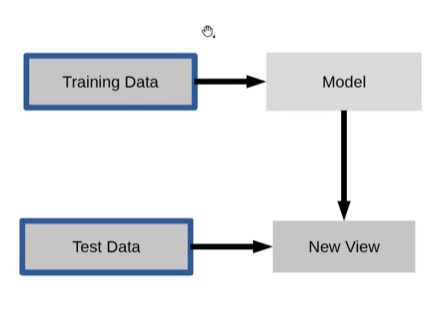

[1. 분류모델 기초] 부터 [2. EDA를 통해 데이터 탐색하기]까지의 강의를 수강하고, 깃허브에 실습 코드와 내용 정리본을 업로드해주세요. (프로젝트 A와 프로젝트 B부분은 하실 필요 없습니다!)

## 1.1
**사이킷런**
1. Classification = 분류, 구분할 수 있는 값이 있을 때 사용.
2. Regression = 효율 측정, 특정 수치를 예상할 때 사용.
3. Clusering = 군집화

**1. Supervised (Machine) learning**
: 정답이 있는 데이터를 맞추는 것. (ex. Classification, Regression)

 
clf = RandomForestClassifier()   
clf.fit(X_train, y_train)   
y_pred = clf.predict(X_text)    
clf.score(X_train, y_train)    

 

**2. Unsupervised (Machine) learning** 
: 정답이 없는 데이터를 맞추는 것. (ex. Clustering)

pca = PCA()  
pca.fit(X_train)  
X_new = pca.transform(X_test)  

 

